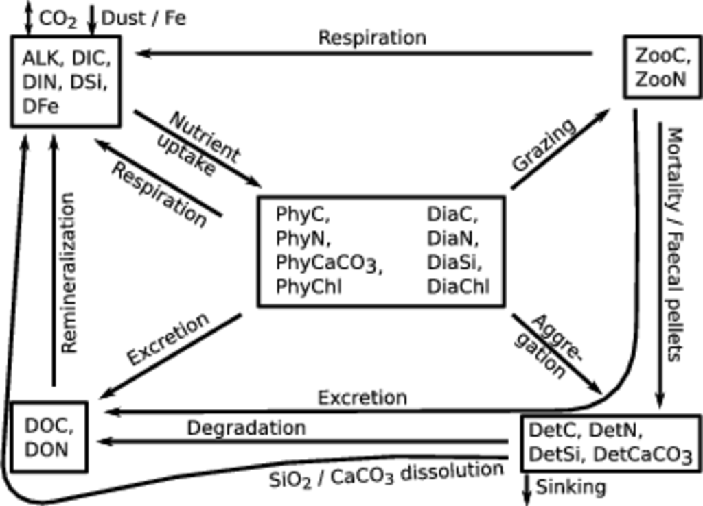

.. highlight:: shell

============
Introduction
============

The Regulated Ecosystem Model, version 2, (REcoM-2) describes the
biogeochemistry in the ocean with a relatively simple ecological model
including two phytoplankton functional types (diatoms and non-diatoms), one
zooplankton and one detritus compartment, and inorganic and organic
forms of the main nutrients (Figure \ref{images/Figure1.eps}). Some emphasis is put on phytoplankton
physiology, which is described in a way that allows for changes in
cellular stoichiometry (N:C:Chl:Si for diatoms and N:C:Chl for
non-diatoms, respectively). All in all, the model solves mass balance
equations for 21 tracers, which are described by equations of the type

.. math::
   \frac{\partial{A}}{\partial{t}} =-(\mathbf{U} + \mathbf{w})\cdot \mathbf{\nabla} A + 
   \mathbf{\nabla} \cdot \left( \kappa \mathbf{\nabla} A \right) + S(A)

where :math:`\mathbf{A}` is the volumetric concentration of a tracer, :math:`\mathbf{U}` is the
three-dimensional advection velocity and :math:`\kappa` is the diffusivity,
both supplied by the physical circulation model. The sinking velocity of particles 
:math:`\mathbf{w} = (0,0,w)` increases linearly with depth for detritus and has
a constant value for phytoplankton and diatoms.

:math:`\mathbf{S(A)}` are the biogeochemical sources or sinks of the
tracer :math:`\mathbf{A}` and are described in detail, for any of the tracers, in the
following.  

 
   *Schematic sketch of the ecosystem model REcoM-2. The 21 tracers can be grouped (indicated by boxes) into dissolved nutrients and carbonate system parameters (upper left), phytoplankton (center), zooplankton (upper right), detritus (lower right), and dissolved organic material (lower left). Source and sink terms are depicted by arrows, short arrows denote exchange with atmosphere and sediments. Not shown: sediments also release alkalinity, inorganic nutrients and dissolved organic matter.*

      
Carbonate chemistry
===================
.. _sec_carbchem:

Dissolved inorganic carbon (:math:`\mathrm{DIC}`)
-------------------------------------------------
The balance of :math:`\mathrm{DIC}` is affected by a number of processes; sources for
DIC are respiration by nanophytoplankton (:math:`phy`), diatoms (:math:`dia`) and
heterotrophs (:math:`het`), remineralization of dissolved organic carbon
(:math:`\mathrm{DOC}`) and dissolution of calcitic detritus (:math:`det`). Sinks are carbon
fixation by primary producers and the formation of calcium carbonate
(:math:`Z`). In addition, sea-air flux of :math:`CO_2` (:math:`F_{\mathrm{C}}`) leads to an
exchange of carbon with the atmosphere, depending on the partial
pressure difference of :math:`CO_2` between ocean and atmosphere. This
exchange is treated separately as boundary condition in section

.. math::
   \begin{split}
   S(\mathrm{DIC}) = & \;(r_{phy} - p_{phy}) \cdot \mathrm{C}_{phy} + (r_{dia} - p_{dia})
   \cdot \mathrm{C}_{dia} \\ &\; + r_{het} \cdot \mathrm{C}_{het} + \rho_{\mathrm{DOC}} \cdot f_T
   \cdot \mathrm{DOC}\\ &\; + \lambda \cdot \mathrm{CaCO}_{3 \,det} - Z
   \end{split}
 
See section \ref{sec:phy} for details on photosynthesis (:math:`p`) and
phytoplankton respiration (:math:`r`) rates. :math:`\mathrm{C}_{phy}`, :math:`\mathrm{C}_{dia}` and
:math:`\mathrm{C}_{het}` refer to carbon biomass of nanophytoplankton, diatoms and
heterotrophs, respectively. See section \ref{sec:het} for the
formulation of the heterotrophic respiration rate (:math:`r_{het}`) and
section \ref{sec:dom} for the DOC remineralization term (:math:`\rho_{\mathrm{DOC}} \cdot f_T \cdot \mathrm{DOC}`). 
The calcite dissolution rate (:math:`\lambda`) is defined
in Eq. \ref{eq:calcdiss} and the calcification flux (:math:`Z`) in
Eq. \ref{eq:calcif}.

